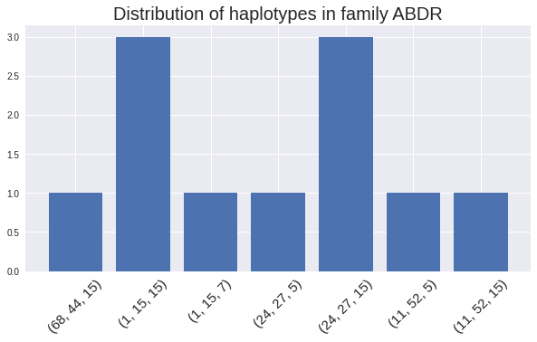

# hla_allele_seperator
Python codebook to extract possible HLA haplotypes from given genotypes in a family

In immunology, esp in transplants, it is often required to separate out two HLA haplotypes of a person. Its not immediately obvious from his genotype: for example, if someone has:

__HLA-A\*24__, __HLA-A\*68__, __HLA-B\*27__ and __HLA-B\*44__

he could have __four__ separate haplotypes - (24,27), (24,44), (68,27) and (68,44). To know which one, we must compare the genotypes of the parents, or at least one parent and a sibling. This algorithm simplfies the task of isolating haplotypes from the genotypes of a complete family and presents them to the immunologist for final decision making.

The **input** is a CSV file with the genotypes, like

```
Name,A_1,A_2,B_1,B_2,C_1,C_2,DRB1_1,DRB1_2,DQB1_1,DQB1_2,DPB1_1,DPB1_2
M,1,68,44,15,1,3,15,7,,,,
F,24,11,27,52,2,3,5,15,,,,
P1,24,68,27,44,1,2,5,15,,,,
P2,1,24,15,27,1,3,7,15,,,,
P3,1,11,15,52,3,4,5,15,,,,
```

The mother (M) and the father's (F) genotypes is followed by all progeny (P1, P2 ...). You also have to specify a __mode__, i.e. which loci have been types ('AB','ABC','ABDR','ABCDR'). The program generates a distribution of available haplotypes in the family.



## TODO
Identify homozygosity
